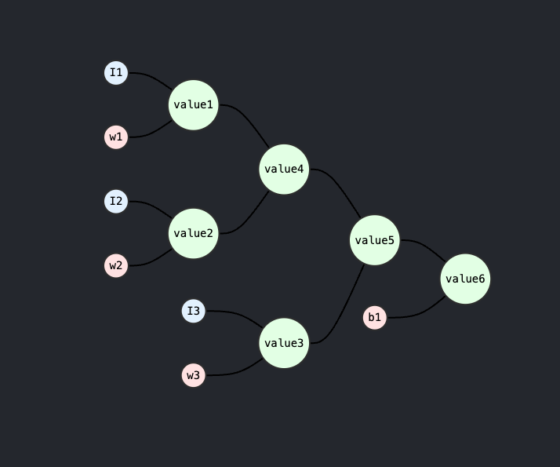

# How to do backpropagation

## Chain rule

 say we have a 1 hidden layer network, it has 4 neurons,
 the input has 3 features, and the output is 2 features

For the first neuron in the hidden layer, it has 3 inputs, and it will produce an output, let's denote it as a1
a1 = sum(w1*I1 + w2*I2 + w3*I3) + b1

in our system, w1, w2, w3, b1 are weights and biases, in this step, we will calculate 6 values, which are:

1. value1: w1*I1, the derivative of w1 is I1, when back propagate, we will get  gradient of w1 = I1* gradient_of_output(value1)
2. value2: w2*I2, the derivative of w2 is I2, when back propagate, we will get  gradient of w2 = I2* gradient_of_output(value2)
3. value3: w3*I3, the derivative of w3 is I3, when back propagate, we will get  gradient of w3 = I3* gradient_of_output(value3)
4. value4: value1 + value2 , the partial derivative of value1 and value2 are both 1, when back propagate, we will get  gradient of value1 and value2 = 1 * gradient_of_output(value4)
5. value5: value4 + value3, the partial derivative of value4 and value3 are both 1, when back propagate, we will get  gradient of value4 and value3 = 1 * gradient_of_output(value5)
6. value6: value5 + b1, the partial derivative of value5 is 1, when back propagate, we will get  gradient of value5 = 1 * gradient_of_output(value6)

The topological order of the graph is:

Now we know the output of the first neuron in the hidden layer is value6,
let us understand the gradient of the value6.

If we look at the path from value6 to outputs, it has 2 paths,

1. output1 = sum(w5*a1 + w6*a2) + b2
2. output2 = sum(w7*a1 + w8*a2) + b3

## Partial derivatives

## Backpropagation
