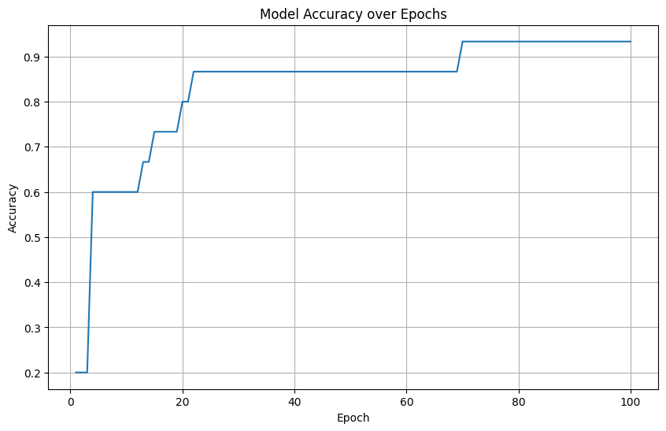
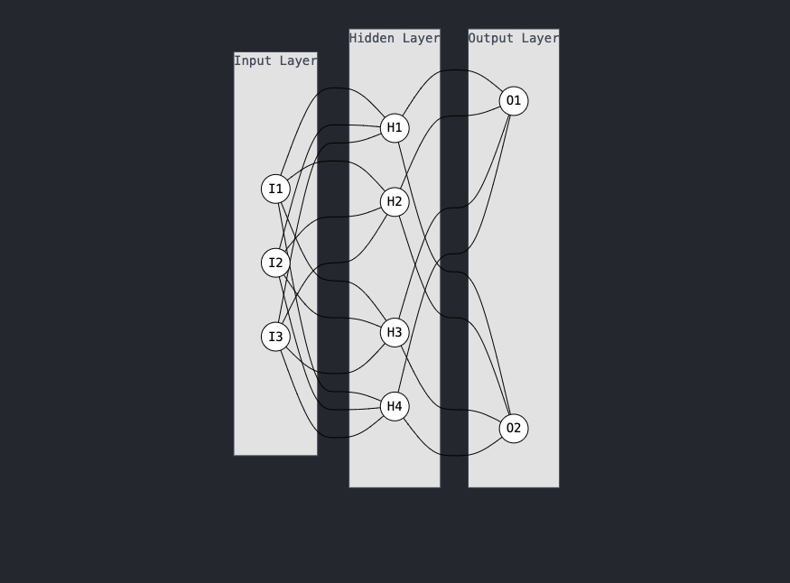
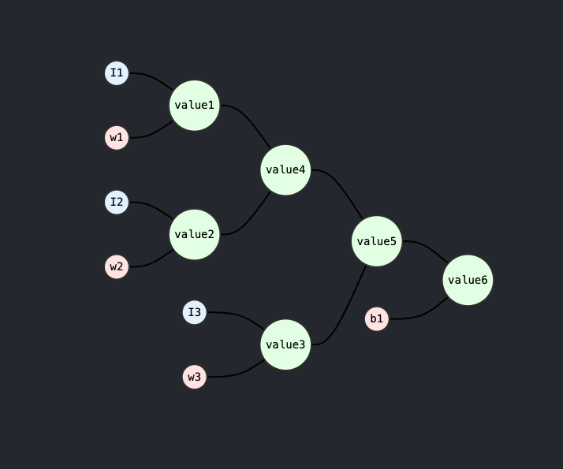

This is a toy example to show how to do backpropagation.
This is for learning purpose only.
This is an imitation of <https://github.com/karpathy/micrograd>.

## The Limitation

1. Only support scalar operation
2. Very slow, not suitable for large-scale data
3. Only support fully connected layer, there is no CNN, RNN, L1/L2 regularization, dropout, etc.

However, it is a good example to understand the backpropagation.

## What it has

1. a simple linear model
2. auto backward with gradient accumulation
3. relu activation

## Performance

on the iris dataset, the accuracies along with the epochs are as follows:


## How to run

#### Implement a simple linear model

```

from nn.layer import Layer


class Model:
    def __init__(self, in_dim, out_dim):
        self.layer1 = Layer(in_dim, 5)
        self.layer2 = Layer(5, 5)
        self.layer3 = Layer(5, out_dim)
```

see demo.ipynb for more details

## How to understand the backpropagation

 say we have a 1 hidden layer network, it has 4 neurons,
 the input has 3 features, and the output is 2 features



### Forward pass

For the first neuron in the hidden layer, it has 3 inputs, and it will produce an output, let's denote it as a1
a1 = sum(w1*I1 + w2*I2 + w3*I3) + b1

in our system, w1, w2, w3, b1 are weights and biases, in this step, we will calculate 6 values, which are:

1. value1: w1*I1, the derivative of w1 is I1, when back propagate, we will get  gradient of w1 = I1* gradient_of_output(value1)
2. value2: w2*I2, the derivative of w2 is I2, when back propagate, we will get  gradient of w2 = I2* gradient_of_output(value2)
3. value3: w3*I3, the derivative of w3 is I3, when back propagate, we will get  gradient of w3 = I3* gradient_of_output(value3)
4. value4: value1 + value2 , the partial derivative of value1 and value2 are both 1, when back propagate, we will get  gradient of value1 and value2 = 1 * gradient_of_output(value4)
5. value5: value4 + value3, the partial derivative of value4 and value3 are both 1, when back propagate, we will get  gradient of value4 and value3 = 1 * gradient_of_output(value5)
6. value6: value5 + b1, the partial derivative of value5 is 1, when back propagate, we will get  gradient of value5 = 1 * gradient_of_output(value6)

The topological order of the graph is:



Now we know the output of the first neuron in the hidden layer is value6.

### Partial derivatives of the parameters
>
> Detailed description of how to calculate the partial derivatives of +/*/** operations can be found in value.py

+ for w1, w2, w3, the partial derivative is the input1/input2/input3, and the gradient is the partial derivative * gradient of the output
+ for b1, the partial derivative is 1, and the gradient is the partial derivative * gradient of the output

### Backward pass

TODO: add more an animation to show the back propagation
While back propagating, we will get the gradient of the output, which is the gradient of the loss function.
The gradient will then be propagated to the output layer, then to the hidden layer.
Value6 could get the gradient of its parent(s), and it will keep back propagating to the hidden layer.

### Update the parameters

we just need to update the parameters with the gradient.
which is new_parameter = old_parameter - learning_rate * gradient
